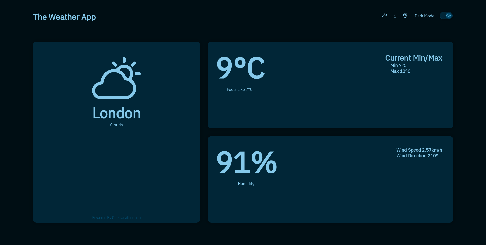
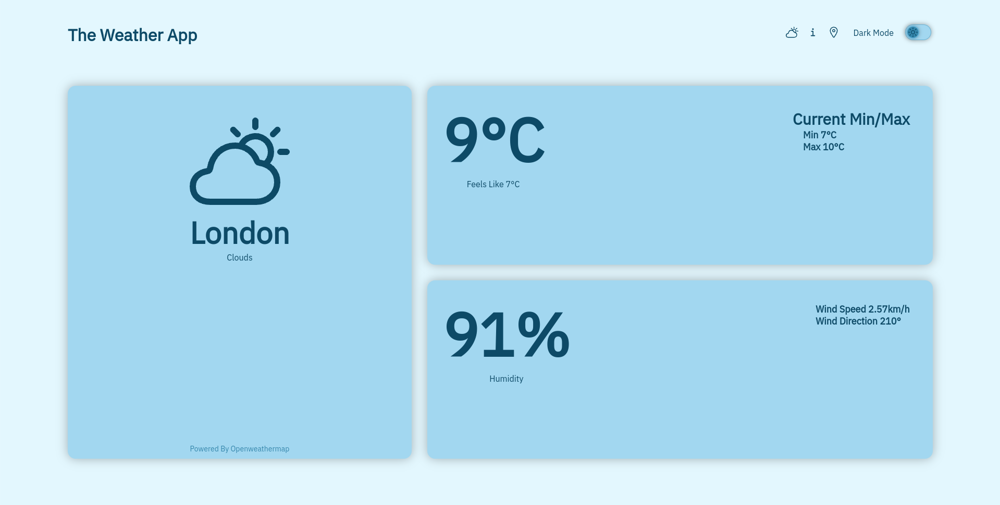
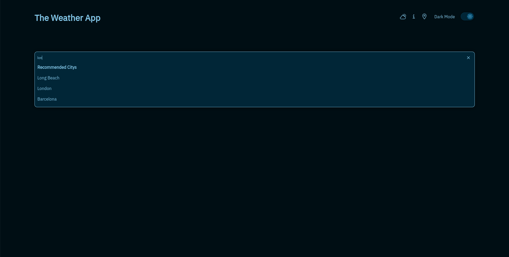

# The Weather App

## What is it?
The weather app is a simple website that allows users to veiw the current weather any where around the world. It has a simple get nice user interface. To enter a location go to the location pin in the top lef and enter the location. You can also change from light to dark mode by switching the slider witch is located in the top left.

## How Is This Helpful?
This website is help fall because you can easy check the weather and at some point everyone will need to check the current weather somwhere in the world!

## Links
- [Replit Link](https://replit.com/@GoodVessel92551/The-Weather-App)
- [Website Link](https://the-weather-app.goodvessel92551.repl.co/)
- [Github Repo]()

## Images

#### The Main Screen (Dark Mode)

#### Main Screen (Light Mode)

#### Search Screen (Dark Mode)

